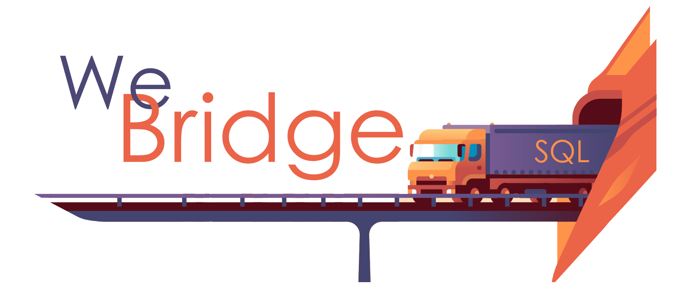

# WeBridge OpenJDK Concolic Execution Engine

Implementation of a concolic execution engine on top of Openjdk 8.

The engine currently only supports interpreter mode execution.

# Quick start

Refer to the /docs directory and get your hands dirty.
